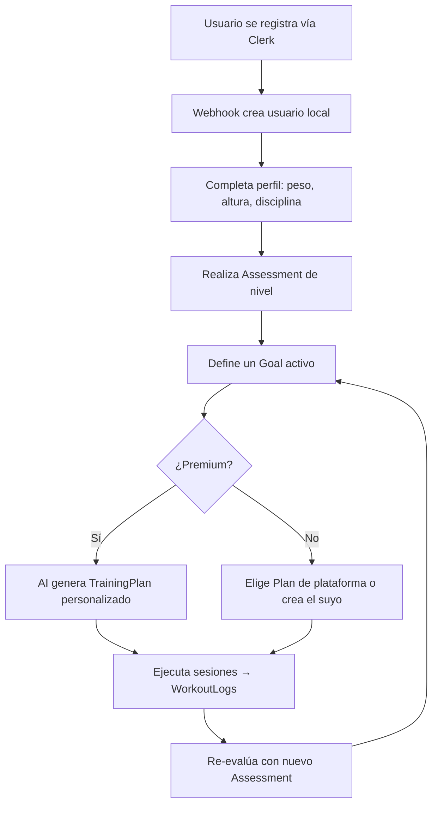

# 🧗 Only Climb API

> Plataforma de entrenamiento de escalada potenciada por IA — Backend API

[](https://jdk.java.net/25/)
[](https://spring.io/projects/spring-boot)
[](https://www.postgresql.org/)
[]()

**Only Climb** ayuda a escaladores a evaluar su nivel físico mediante tests estandarizados, fijar objetivos, y recibir planes de entrenamiento personalizados (generados por IA o curados por la plataforma). Permite registrar sesiones, seguir el progreso y entrenar en comunidad.

---

## 🏗️ Arquitectura

Arquitectura **hexagonal (Ports & Adapters)** con 3 capas concéntricas:

```
infrastructure/ → application/ → domain/
    (Spring,       (orquestación,  (lógica pura,
     JPA, REST)     casos de uso)   sin frameworks)
```

- **`domain/`** — Entidades, value objects, puertos (interfaces), excepciones. **Cero dependencias de frameworks.**
- **`application/`** — Servicios que implementan los puertos de entrada, usando los de salida.
- **`infrastructure/`** — Spring MVC, Spring Data JPA, Spring Security, Flyway, configuración.

### Regla de oro
**El dominio no sabe nada de infraestructura.** No hay `@Service`, `@Repository`, ni `@Entity` dentro de `domain/`.

---

## 🛠️ Stack Tecnológico

| Tecnología | Versión | Uso |
|---|---|---|
| Java | 25 | Lenguaje base |
| Spring Boot | 4.0.6 | Framework de aplicación |
| Spring MVC | 4.x | API REST |
| Spring Data JPA | 4.x | Persistencia |
| Spring Security | 4.x | Autenticación OAuth2 (JWT) |
| PostgreSQL | 17 | Base de datos |
| Flyway | 10.x | Migraciones |
| Lombok | 1.18.x | Reducción de boilerplate |
| Springdoc OpenAPI | 2.8.x | Documentación Swagger |
| Testcontainers | 2.x | Tests de integración |
| Docker Compose | — | Desarrollo local |

---

## 🚀 Arranque rápido

### Requisitos
- Java 25
- Docker y Docker Compose
- Maven Wrapper (incluido: `./mvnw`)

### 1. Levantar PostgreSQL
```bash
docker compose up -d
```

### 2. Ejecutar la aplicación
```bash
export JAVA_HOME=$HOME/.local/jdks/jdk-25.0.3+9
export PATH=$JAVA_HOME/bin:$PATH
./mvnw spring-boot:run
```

La API arranca en `http://localhost:8080`.

### 3. Swagger UI
```
http://localhost:8080/swagger-ui.html
```

### 4. Tests
```bash
./mvnw verify
```

---

## 🔐 Autenticación

La API es **stateless** y confía en JWTs emitidos por **Clerk** (auth provider externo). No se almacenan contraseñas.

- Cada petición autenticada incluye un `Authorization: Bearer <jwt>`.
- Los usuarios se crean/actualizan/eliminan vía webhooks de Clerk (`POST /api/v1/webhooks/clerk`), verificados con firma **Svix**.
- Roles (`USER`, `ADMIN`) residen en la BD local, no en el JWT.
- Endpoints `GET` públicos (catálogos, ejercicios, plantillas, planes). El resto requiere autenticación.

---

## 📦 Funcionalidades

### ✅ Implementadas

#### 👤 Usuarios
| Endpoint | Descripción |
|---|---|
| `GET /api/v1/users/me` | Perfil del usuario autenticado |
| `GET /api/v1/users/me/profile` | Perfil extendido (peso, altura, disciplina, locale) |
| `PUT /api/v1/users/me/profile` | Actualizar perfil |
| `GET /api/v1/users/{id}` | Ver usuario por ID (admin o self) |
| `GET /api/v1/users/{id}/profile` | Perfil de otro usuario |
| `POST /api/v1/webhooks/clerk` | Webhook de Clerk (provisiona usuarios) |

#### 🏋️ Ejercicios
| Endpoint | Descripción |
|---|---|
| `GET /api/v1/exercises` | Listar ejercicios (paginado, filtrable) |
| `GET /api/v1/exercises/{id}` | Ver ejercicio |
| `POST /api/v1/exercises` | Crear ejercicio (usuario) |
| `PUT /api/v1/exercises/{id}` | Editar ejercicio propio |
| `DELETE /api/v1/exercises/{id}` | Eliminar ejercicio propio |

Categorías: `HANGBOARD`, `PULL`, `CORE`, `ANTAGONIST`, `FLEXIBILITY`, `ENDURANCE`, `TECHNIQUE`.  
Parámetros: reps, sets, descanso, duración, peso, % intensidad, profundidad de regleta, tipo de agarre, RPE.

#### 📋 Workout Templates (sesiones de entrenamiento)
| Endpoint | Descripción |
|---|---|
| `GET /api/v1/workout-templates` | Listar plantillas |
| `GET /api/v1/workout-templates/{id}` | Ver plantilla |
| `POST /api/v1/workout-templates` | Crear plantilla |
| `PUT /api/v1/workout-templates/{id}` | Editar plantilla propia |
| `DELETE /api/v1/workout-templates/{id}` | Eliminar plantilla propia |
| `POST /api/v1/workout-templates/{id}/fork` | Forkear plantilla de plataforma |

#### 📅 Training Plans (planes multi-semana)
| Endpoint | Descripción |
|---|---|
| `GET /api/v1/training-plans` | Listar planes (con filtros avanzados) |
| `GET /api/v1/training-plans/{id}` | Ver plan |
| `POST /api/v1/training-plans` | Crear plan |
| `PUT /api/v1/training-plans/{id}` | Editar plan propio |
| `DELETE /api/v1/training-plans/{id}` | Eliminar plan propio |
| `POST /api/v1/training-plans/{id}/fork` | Forkear plan de plataforma |

Filtros: disciplina, dificultad, objetivo, volumen, duración, rango de grado, equipamiento requerido.

#### 📊 Assessments (evaluaciones)
| Endpoint | Descripción |
|---|---|
| `GET /api/v1/assessments/definitions` | Definiciones de tests (plataforma) |
| `POST /api/v1/assessments/results` | Registrar resultado de evaluación |
| `GET /api/v1/assessments/results` | Listar resultados del usuario |
| `GET /api/v1/assessments/results/{id}` | Ver resultado |
| `DELETE /api/v1/assessments/results/{id}` | Eliminar resultado |

Los resultados son **inmutables** — son registros históricos.

#### 🎯 Goals (objetivos)
| Endpoint | Descripción |
|---|---|
| `GET /api/v1/goals` | Listar objetivos del usuario |
| `GET /api/v1/goals/{id}` | Ver objetivo |
| `POST /api/v1/goals` | Crear objetivo |
| `PUT /api/v1/goals/{id}` | Editar objetivo |
| `DELETE /api/v1/goals/{id}` | Eliminar objetivo |
| `POST /api/v1/goals/{id}/achieve` | Marcar como conseguido |

Un usuario tiene **un solo objetivo activo** a la vez (constraint único parcial en BD).

#### 📝 Workout Logs (registro de sesiones)
| Endpoint | Descripción |
|---|---|
| `GET /api/v1/workout-logs` | Listar sesiones realizadas |
| `GET /api/v1/workout-logs/{id}` | Ver sesión |
| `POST /api/v1/workout-logs` | Registrar sesión |
| `PUT /api/v1/workout-logs/{id}` | Editar registro |
| `DELETE /api/v1/workout-logs/{id}` | Eliminar registro |

Cada entrada registra valores planeados vs reales (`COMPLETED`, `SKIPPED`, `MODIFIED`).

#### 🔗 Social: Follow
| Endpoint | Descripción |
|---|---|
| `POST /api/v1/users/{id}/follow` | Seguir usuario |
| `DELETE /api/v1/users/{id}/follow` | Dejar de seguir |
| `GET /api/v1/users/{id}/followers` | Lista de seguidores |
| `GET /api/v1/users/{id}/following` | Lista de seguidos |
| `GET /api/v1/users/{id}/follow-stats` | Estadísticas (siguiendo/seguidores) |

#### 📚 Catálogos (públicos)
| Endpoint | Descripción |
|---|---|
| `GET /api/v1/catalogs/exercise-categories` | Categorías de ejercicios |
| `GET /api/v1/catalogs/muscle-groups` | Grupos musculares |
| `GET /api/v1/catalogs/grip-types` | Tipos de agarre |
| `GET /api/v1/catalogs/parameter-types` | Tipos de parámetros |
| `GET /api/v1/catalogs/goal-types` | Tipos de objetivos |
| `GET /api/v1/catalogs/equipment` | Equipamiento |
| `GET /api/v1/catalogs/grades` | Grados de escalada (French + Font) |

Todos los catálogos tienen **i18n** (ES + EN mínimo, español por defecto).

---

### ❌ Pendientes de implementar

| Funcionalidad | Estado | Prioridad |
|---|---|---|
| **AI Plan Generation** — Generación asíncrona de planes con LLM externo (OpenAI) | Schema en V11, sin controller/service/worker | 🔴 Alta |
| **Subscriptions** — Tiers, planes, pagos (Stripe), estado de suscripción | Schema en V2, sin controller/service | 🔴 Alta |
| **Payment Webhooks** — Webhooks de Stripe para sync de suscripciones | Sin implementar | 🔴 Alta |
| **Training Groups** — Grupos de entrenamiento con roles y plan compartido | Schema en V10, sin controller/service | 🟡 Media |
| **Media Management** — Assets multimedia (imágenes, vídeos) | Schema en V4, sin controller/service | 🟡 Media |
| **Social Activity Feed** — Feed de actividad de seguidos | Sin implementar | 🟢 Baja |
| **Admin Endpoints** — Gestión de contenido de plataforma (admin crea ejercicios/planes/assessments) | Sin implementar | 🟡 Media |
| **SSE para AI Jobs** — Notificaciones server-sent events para estado de jobs de IA | Sin implementar | 🟡 Media |
| **Climbing Gym / Routes** — Gimnasios y vías (mencionados en SecurityConfig) | Sin implementar | 🟢 Baja |

---

## 🗄️ Estructura de la BD

15 migraciones Flyway que construyen el schema completo:

| Migración | Contenido |
|---|---|
| V1 | Extensiones (`pgcrypto`) y tipos ENUM |
| V2 | `users`, `user_profiles`, subscriptions (`tiers`, `plans`, `user_subscriptions`, `invoices`, `webhook_events`) |
| V3 | Catálogos: `climbing_grades`, `exercise_categories`, `muscle_groups`, `grip_types`, `parameter_types`, `goal_types`, `equipment` (todos con traducciones) |
| V4 | `media_assets` (multimedia con storage provider abstracto) |
| V5 | `exercises` (con parámetros, músculos, traducciones) |
| V6 | `workout_templates` y `workout_template_exercises` (sesiones) |
| V7 | `training_plans` y su jerarquía `weeks → sessions` (planes multi-semana) |
| V8 | `assessment_definitions`, `assessment_tests`, `assessment_results`, `assessment_metrics` |
| V9 | `user_goals` y `workout_logs` + `workout_log_entries` |
| V10 | `training_groups` (grupos) y `user_followers` (grafo social) |
| V11 | `ai_plan_generation_jobs` (jobs asíncronos de IA) |
| V12-V15 | Seeds: assessments, contenido ES, training plans, catálogo |

---

## 🌍 Internacionalización (i18n)

- **Locale por defecto**: `es` (español)
- **Idiomas requeridos**: ES + EN para contenido de plataforma
- El contenido creado por usuarios se almacena en el idioma en que se escribe (sin traducción automática)
- Las traducciones se resuelven vía header `Accept-Language`

---

## 📐 Convenciones de código

- **Nombrado de puertos**: `<Acción><Entidad>UseCase` (input), `<Entidad>Repository` (output)
- **Nombrado de servicios**: `<Entidad>Service`
- **Nombrado de controladores**: `<Entidad>Controller`
- **Nombrado de adaptadores JPA**: `Jpa<Entidad>Repository`
- **Inyección**: Solo por constructor (`@RequiredArgsConstructor`)
- **Validación**: Bean Validation en DTOs de entrada; validación de invariantes en constructores del dominio
- **Respuestas**: `ResponseEntity<>` con DTOs (nunca entidades de dominio directamente)

---

## 📂 Estructura del proyecto

```
src/main/java/app/onlyclimb/api/
├── OnlyClimbApiApplication.java
├── domain/
│   ├── model/          ← Entidades, value objects (User, Exercise, TrainingPlan, Goal...)
│   ├── port/
│   │   ├── in/         ← Interfaces de casos de uso (CreateExerciseUseCase, ...)
│   │   └── out/        ← Interfaces de repositorios (ExerciseRepository, ...)
│   └── exception/      ← Excepciones de dominio
├── application/
│   └── service/        ← Implementaciones de casos de uso (ExerciseService, ...)
└── infrastructure/
    ├── adapter/
    │   ├── in/
    │   │   ├── web/    ← Controladores REST + DTOs
    │   │   └── auth/   ← Autenticación Clerk JWT + Svix
    │   └── out/
    │       └── persistence/  ← Repositorios JPA, entidades JPA, mappers
    └── config/         ← Spring Security, OpenAPI, Clerk properties
```

---

## 📄 API Docs

La documentación interactiva está disponible en:
- **Swagger UI**: `http://localhost:8080/swagger-ui.html`
- **OpenAPI JSON**: `http://localhost:8080/v3/api-docs`

---

## 🔄 Flujo de usuario principal



---

## 🤝 Productos de referencia

- [Lattice Training](https://latticetraining.com) — Planes de entrenamiento para escalada
- [Climbro](https://climbro.com) — Evaluación y seguimiento

---

## 📝 Licencia

Propietaria. Todos los derechos reservados.
